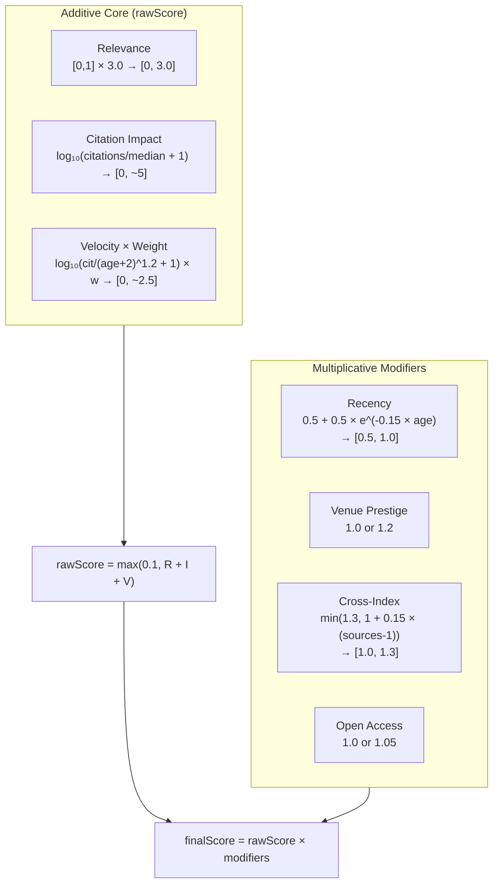
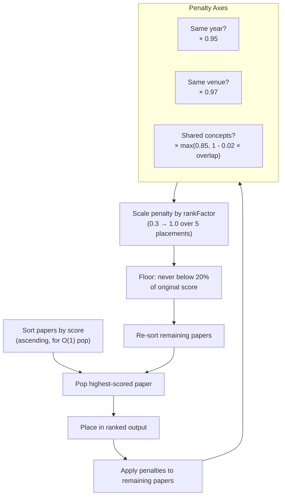

# how kumo ranks papers

kumo runs a client-side ranking algorithm called **AIVS** (Academic Impact & Velocity Score) that takes raw results from seven different academic APIs and produces a single, unified ranking. this document explains how every part of it works, why each decision was made, and where the system's limits are.

## the problem

academic search is fundamentally a federation problem. there is no single API that indexes all papers with all metadata. arxiv has preprints but no citation counts. openalex has citation data but spotty full-text links. semantic scholar has good relevance signals but limited coverage outside CS and biomedical. pubmed central only covers life sciences.

kumo queries up to seven sources simultaneously and merges the results. the challenge is that each source returns results in its own format, with its own relevance scoring system, and with different metadata available. a "relevance score" of 147.3 from openalex means something completely different from semantic scholar returning results in what it considers relevance order.

the ranking algorithm's job is to take these incompatible signals and produce a single ordering that feels right to a researcher.

## architecture

```mermaid
flowchart LR
    subgraph sources["Source APIs"]
        OA["OpenAlex"]
        AX["arXiv"]
        BIO["bioRxiv"]
        PMC["EuropePMC"]
        SS["Semantic Scholar"]
        CO["CORE"]
        ZE["Zenodo"]
    end

    subgraph normalize["Adapter Layer"]
        N["Normalize to [0,1]\nrelevance scale"]
    end

    subgraph merge["Merge"]
        DOI["DOI dedup"]
        FUZ["Fuzzy title\ndedup (0.92)"]
    end

    subgraph rank["AIVS Ranking"]
        P1["Pass 1\nAbsolute Scoring"]
        P2["Pass 2\nMMR Diversification"]
    end

    sources --> N --> merge --> P1 --> P2 --> OUT["Ranked Results"]
```



the system runs in two files:
- **search-engine.ts** handles API communication, response parsing, and relevance normalization
- **SearchPage.tsx** contains the ranking algorithm itself

## step 1: adapter normalization

this is the foundation that makes everything else work. every source adapter normalizes its relevance signal to a **[0, 1]** scale before results enter the ranking pipeline.

### why this matters

without normalization, the ranking is broken in ways that aren't obvious. here's what the raw scores look like across sources:

| source | what "relevance" means | raw range |
|--------|----------------------|-----------|
| openalex | BM25 text similarity score | 0 – 200+ |
| arxiv | position in result list | 1 – 15 |
| biorxiv | position in result list | 1 – 20 |
| europepmc | position in result list | 1 – 20 |
| semantic scholar | position in result list | 1 – 20 |
| core | position in result list | 1 – 20 |
| zenodo | position in result list | 1 – 20 |

if you feed these raw numbers into the same formula, openalex dominates every ranking regardless of actual relevance. a mediocre openalex result with a BM25 score of 80 would outrank arxiv's #1 result (score: 15) every time.

### how normalization works

```mermaid
flowchart TD
    subgraph openalex["OpenAlex Normalization"]
        OA1["Get BM25 scores from API"]
        OA2["Find batch maximum"]
        OA3["Divide each score by max"]
        OA4["Best result → 1.0\nWorst → score/max"]
        OA1 --> OA2 --> OA3 --> OA4
    end

    subgraph positional["Positional Normalization (6 sources)"]
        P1["Results arrive in ranked order"]
        P2["Score = (total - index) / total"]
        P3["#1 result → 1.0\nLast → 1/total"]
        P1 --> P2 --> P3
    end

    subgraph doi["DOI Lookup"]
        D1["Exact match by definition"]
        D2["Hardcode to 1.0"]
        D1 --> D2
    end
```



**openalex (search):** the API returns a BM25 text-similarity score. we divide each score by the maximum in the batch. the top result gets 1.0, others scale proportionally.

**openalex (DOI lookup):** a DOI lookup is an exact match — the user asked for a specific paper. relevance is always 1.0.

**all other sources:** these APIs return results in relevance order but don't expose a numeric score. we use `(totalResults - index) / totalResults`, which gives the first result 1.0 and the last result `1/n`.

### what we deliberately removed

the openalex adapter previously fell back to `cited_by_count` when no BM25 score was available:

```
relevanceScore: item.relevance_score || item.cited_by_count || 0
```

this created a feedback loop where citations were counted three times in the final score — once through the relevance signal, once through the citation impact formula, and once through the velocity formula. a paper with 50,000 citations would get maximum relevance regardless of whether it actually matched the query. we removed the fallback entirely.

## step 2: deduplication and merging

the same paper often appears in multiple sources (an arxiv preprint might also be indexed in openalex and semantic scholar). before ranking, we merge duplicates:

1. **DOI matching** — exact match on normalized DOI strings
2. **fuzzy title matching** — bigram similarity ≥ 0.92 for papers without DOIs

when merging, we keep the best metadata from each source (longest abstract, most authors, highest citation count, all PDF links). the relevance score takes the maximum from either source.

## step 3: absolute scoring (pass 1)

each paper gets a composite score from six signals combined into an additive core and multiplicative modifiers.



### signal breakdown

#### relevance (weight: × 3.0)

the normalized [0, 1] relevance score multiplied by 3.0. this is the strongest additive signal by design — a paper that matches the query well should rank above a paper that doesn't, regardless of citation count.

**why 3.0?** with citation impact reaching ~5 for highly-cited papers, a weight below 2.0 would let citations dominate relevance. 3.0 keeps relevance competitive with even strong citation signals while not completely overwhelming them. a paper with perfect relevance (3.0) and zero citations can still be outranked by a paper with moderate relevance (1.5) and high citations (~4.0 impact).

#### citation impact

```
normalizedCitations = citations / medianCitations
baseImpact = log₁₀(normalizedCitations + 1)
```

citations are normalized against the median of the result set (excluding papers with zero citations). the log scale prevents extremely highly-cited papers from completely dominating — a paper with 10,000 citations scores ~3.0, not 10,000x higher than a paper with 1 citation.

**why exclude zeros from the median?** many sources (arxiv, zenodo, core) don't return citation counts at all. if you include those zeros, the median drops to 0 and the floor kicks in. the old floor of 10 was too high — in a niche field where the median is genuinely 3, a floor of 10 compressed the entire distribution. we now use a floor of 1 and compute the median only over papers that actually have citation data.

#### velocity

```
velocity = citations / (age + 2)^1.2
velocityImpact = log₁₀(velocity + 1)
velocityWeight = 0.4 + 0.4 × e^(-0.3 × age)
```

velocity measures how fast a paper is accumulating citations relative to its age. a 2-year-old paper with 100 citations is more remarkable than a 20-year-old paper with 100 citations.

the velocity weight decays exponentially — for new papers (age 0), velocity contributes at 80% strength. for older papers, it fades to 40%. this reflects the reality that velocity is a strong signal for recent papers ("is this catching on?") but less meaningful for established work.

**why `age + 2` instead of `age + 1`?** with `age + 1`, a paper published in december vs january of the following year could see a 2.3x velocity difference purely from the year boundary. `age + 2` smooths this to a 1.6x ratio — still meaningful, but not a cliff.

#### recency

```
blendedRecency = 0.5 + 0.5 × e^(-0.15 × age)
```

| age | recency multiplier |
|-----|-------------------|
| 0 (this year) | 1.00 |
| 2 | 0.87 |
| 5 | 0.74 |
| 10 | 0.61 |
| 20 | 0.52 |
| 30+ | ~0.50 |

this is a multiplicative modifier, not an additive signal. a 30-year-old paper gets its score halved compared to an identical paper published today. this is aggressive by design — in most research contexts, newer results that build on older work are more useful than the older work itself. a researcher searching for "transformer architectures" in 2026 probably wants papers from the last few years, not the original 2017 paper (though that will still rank well due to its massive citation count).

#### venue prestige

papers published in elite venues get a 20% score boost. detection uses two mechanisms:

**regex matching** for multi-word venue names and short but unambiguous tokens:
`nature communications`, `nature medicine`, `nature methods`, `nature biotechnology`, `nature genetics`, `nature neuroscience`, `neurips`, `nips`, `iclr`, `icml`, `cvpr`, `iccv`, `eccv`, `acl`, `emnlp`, `naacl`, `lancet`, `new england journal`, `jama`, `chi`, `siggraph`, `physical review`, `ieee transactions`, `acm transactions`, `proceedings of the national academy`

**exact matching** for single-word journal names that would false-positive as substrings:
`nature`, `science`, `cell`

"cell" is only in the exact-match set because `\bcell\b` in the regex would match "Fuel Cell Research." the exact set checks whether the entire normalized venue string equals "cell" — so only the journal Cell matches.

#### cross-index authority

```
crossIndexBonus = min(1.3, 1 + 0.15 × (sourceCount - 1))
```

a paper that appears in multiple independent indexes gets up to a 30% boost. appearing in openalex, arxiv, and semantic scholar simultaneously is a signal that the paper is well-established and properly indexed. it's not a perfect quality signal (it correlates with field — CS papers tend to appear in more indexes than humanities papers), but it adds meaningful confidence to the ranking.

#### open access preference

papers with available PDFs get a 5% boost. this is deliberately small — it shouldn't override quality signals — but it reflects kumo's positioning as a tool for researchers who need papers they can actually read.

#### the rawScore floor

```
rawScore = max(0.1, relevance × 3.0 + impact + velocity × velocityWeight)
```

the floor at 0.1 prevents a paper with zero relevance, zero citations, and no year data from scoring exactly 0. this matters for DOI lookups where a single result might have sparse metadata — without the floor, it would sort below everything else.

## step 4: diversification (pass 2)

a pure relevance ranking tends to produce clusters — five papers from the same lab, same year, same venue, all about the same subtopic. the second pass uses **Maximal Marginal Relevance (MMR)** to push similar papers apart.



### how it works

papers are sorted by their absolute score. the highest-scored paper is placed first (this is always the best absolute match — MMR never overrides the #1 result in practice because rankFactor starts at 0.3).

after each placement, every remaining paper is checked for similarity to the just-placed paper across three axes:

**temporal:** if two papers share a publication year, the remaining one gets a 5% penalty. this pushes the ranking to spread across time periods.

**venue:** if two papers are from the same venue, the remaining one gets a 3% penalty. this prevents a single prolific journal from dominating the results.

**semantic:** if two papers share concept tags (from openalex's controlled taxonomy), the remaining one gets penalized based on overlap count, capped at a 15% maximum per-placement penalty. this is the coarsest axis — it's matching taxonomy labels, not actual semantic meaning — but it catches the obvious cases.

### the rankFactor ramp

```
rankFactor = min(1.0, 0.3 + ranked.length × 0.14)
```

| position | rankFactor | effect |
|----------|-----------|--------|
| 1 | 0.44 | penalties applied at 44% strength |
| 2 | 0.58 | |
| 3 | 0.72 | |
| 4 | 0.86 | |
| 5+ | 1.00 | full diversity pressure |

the top results are protected from aggressive diversification. the first paper placed is always the best absolute match. the second and third are only mildly diversified. by position 5, full diversity pressure kicks in. this ramp is smooth — there's no discontinuity where penalty strength suddenly doubles.

### the MMR floor

```
candidate.score = max(originalScore × 0.2, candidate.score × appliedPenalty)
```

no paper can be penalized below 20% of its original absolute score. this prevents a legitimately excellent paper from being pushed to the bottom just because it shares a year and venue with several already-placed papers.

### implementation details

**deterministic tie-breaking:** when two papers have identical scores, they're ordered by paper ID. this prevents the ranking from shuffling between page loads.

**O(1) extraction:** the array is sorted ascending and we pop from the end (O(1)) instead of shifting from the front (O(n)). for 200 papers, this eliminates ~20,000 unnecessary array element moves.

**complexity:** the MMR pass is O(n² log n) due to the re-sort after each placement. for the typical result set of 50-200 papers, this takes under 1ms on modern hardware. if result sizes ever scale to thousands, the sorted array should be replaced with a max-heap.

## what this system does well

**source-agnostic fairness.** the adapter normalization means an arxiv preprint and a nature paper compete on equal footing in terms of relevance. neither source's internal scoring system can silently dominate.

**graceful degradation.** when citation data is missing (most preprint searches), the ranking falls back to relevance and recency. when relevance data is noisy, citations and velocity can compensate. no single missing signal collapses the entire ranking.

**no server required.** the entire pipeline runs in the browser. there's no backend ranking service, no embedding model, no database of pre-computed scores. this means zero infrastructure cost and complete transparency — you can inspect every score in the browser console.

**open access awareness.** the combination of multi-source PDF discovery (unpaywall, arxiv, PMC, CORE) and the OA bonus means researchers without institutional access see useful results, not paywalls.

## known limitations

**relevance in the absence of signal.** for sources that only return positional rankings (six out of seven), the relevance score is just "where did this appear in the API's result list." if the API's own ranking is poor, we inherit that. the ×3.0 weight on relevance means the ranking effectively trusts each source's internal ordering, which may not always be warranted.

**shallow semantic understanding.** the MMR concept overlap works on openalex's taxonomy labels, not on actual content. two papers about the same topic tagged with different concepts won't be diversified. a paper tagged "Attention (psychology)" and one tagged "Transformer (machine learning model)" look completely different to the system, even if they're both about attention mechanisms in neural networks.

**no query intent awareness.** a DOI lookup, a broad keyword search, and an author search all go through the same scoring formula with the same weights. an author search should probably weight citation impact higher and recency lower. a title search should weight relevance much higher. the infrastructure for this exists (the query classifier already identifies intent), but the scoring weights don't adapt to it yet.

**year-granularity age.** the system knows a paper's publication year but not its exact date. two papers published january 1 and december 31 of the same year have identical age values. this creates a mild discontinuity at year boundaries, which the `age + 2` velocity divisor partially mitigates but doesn't eliminate.

**no learning.** the weights are fixed constants. the system doesn't learn from user clicks, bookmarks, or search patterns. in a production system with enough traffic, click-through rate could inform weight tuning per query type. for a client-side tool, this would require anonymized telemetry that many users wouldn't want.

## where it sits relative to the state of the art

for a **client-side, zero-infrastructure** ranking system operating on federated API results with no shared relevance metric and no embedding model, this is arguably at the ceiling of what's achievable. the adapter normalization, multi-signal scoring, and MMR diversification are techniques used in production search systems, adapted for the constraint of running entirely in the browser.

a true step up would require:
- **server-side embedding-based reranking** — even a lightweight bi-encoder on title + abstract would dramatically improve semantic understanding
- **query-type-aware weight profiles** — different scoring formulas for different search intents
- **learned weights from user behavior** — click-through data informing signal balance
- **a unified index** instead of federated APIs — eliminating the normalization problem at the source

these are fundamentally different architectural choices that would move kumo from a client-side tool to a server-dependent platform. the current system deliberately trades some ranking quality for the simplicity and transparency of running entirely in the browser.
